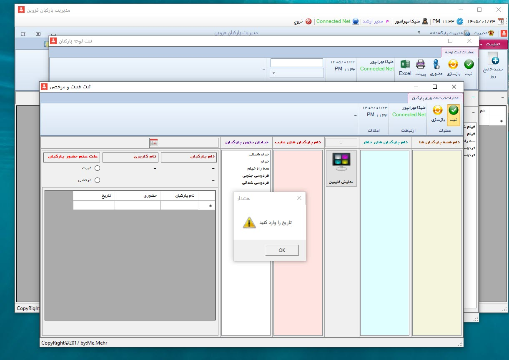
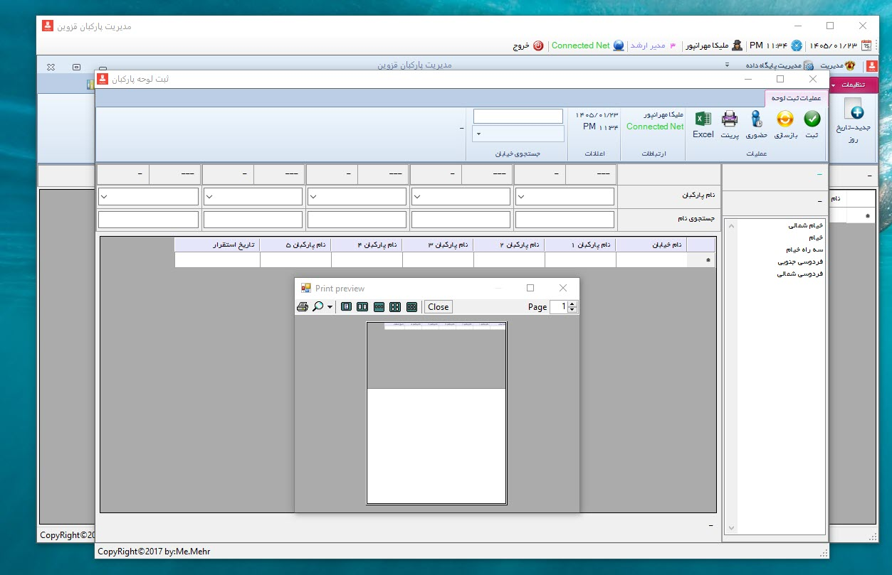
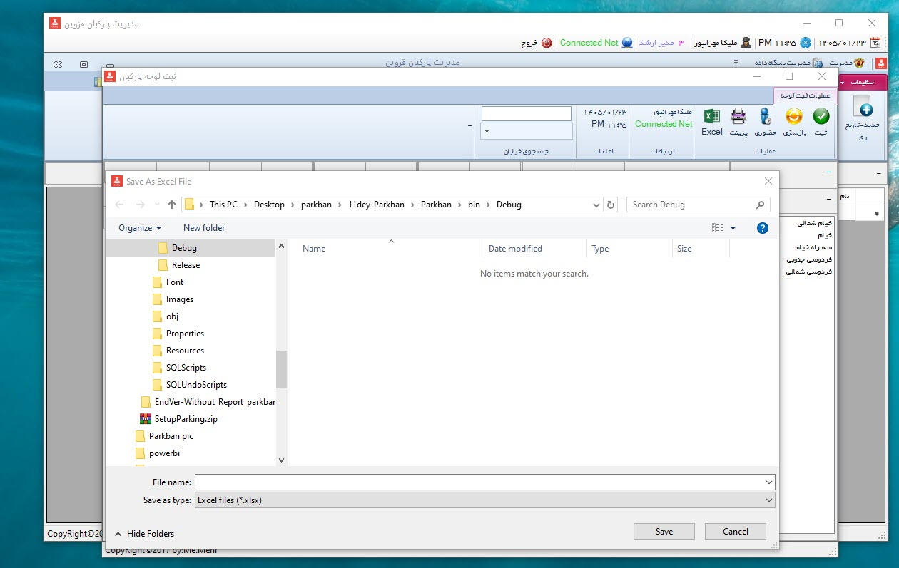
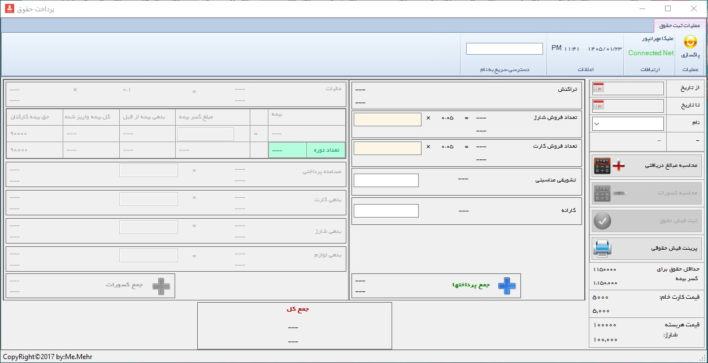
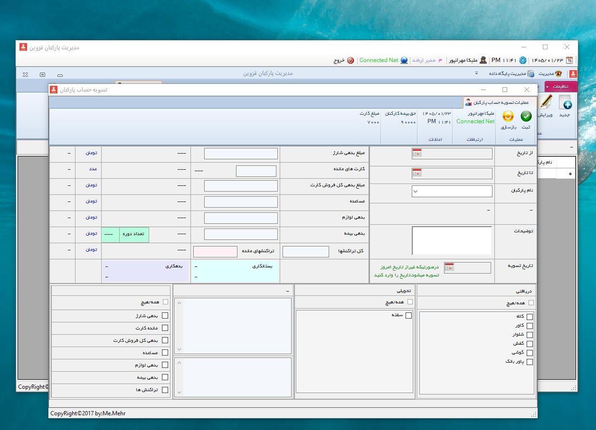
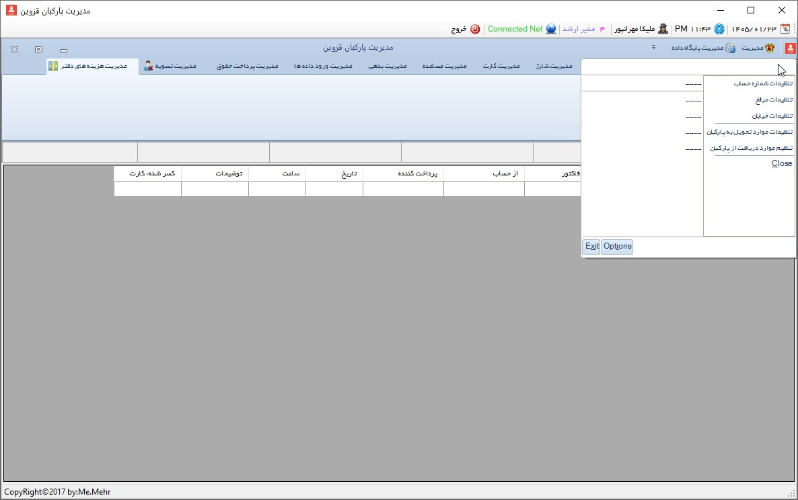
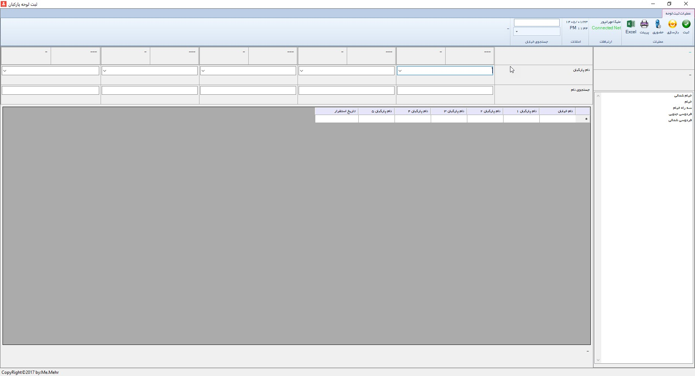

# parkban-parking-attendant-management-system
Windows Forms-based management system for municipal parking attendants, including personnel, attendance, device, payroll, recharge and financial management.

# Parkban – Parking Attendant Management System

**Parkban** is a Persian term meaning **parking attendant**.  
This project is a **Windows Forms-based management system** developed for a municipal contractor to manage parking attendants, assigned devices, daily attendance, recharge packages, card sales, payroll, settlements, and office financial operations.

## Overview

Parkban was designed as an integrated desktop application to support the operational and administrative workflow of parking attendants working under a municipal contractor.

The system was used to register personnel information, manage assigned mobile devices and equipment, track attendance, import operational data from Excel files, calculate payroll, manage debts and advances, and generate various reports for management and accounting purposes.

Although the application did not directly read RFID cards or perform field operations itself, it processed operational data exported from external systems and used that data as part of payroll and financial calculations.

## Main Features

- User authentication with role-based access levels
- Personnel registration and management
- Device registration and assignment
- Street/zone assignment management
- Attendance and leave tracking
- Recharge package management
- Card sales and debt tracking
- Advance payment registration
- Debt management
- Excel-based data import workflow
- Payroll calculation and payslip printing
- Employee settlement workflow
- Office expense registration
- Reporting and printing across different modules
- Database connection, backup, and restore utilities
- Responsive WinForms layout with maximized views and ribbon-style UI

## System Modules

### 1. Login and Access Control
The system includes a login page with username, password, and access level selection.  
Three access levels were defined:

- Senior Manager
- Manager
- System User

A preview option was also available to open forms without logging in.

### 2. Main Dashboard
After login, the user enters the main ribbon-based interface.  
The system displays useful contextual information such as:

- Current date and time
- Logged-in username
- Access level
- Internet connection status

Because the database was hosted online and data could be entered from separate offices, connection visibility was important.

### 3. Device Management
This module manages the mobile phones assigned to parking attendants.

Functions include:
- Registering new devices
- Editing existing devices
- Searching and filtering devices
- Reporting

Each device record may include:
- IMEI
- Phone serial number
- Charger serial number
- SIM card number
- Notes

### 4. Parking Attendant Registration
This section is used to register new parking attendants and their administrative information, including:

- Full name
- National ID
- Phone number
- Account number
- Education
- Employment start date
- Address
- Notes

The module also supports:
- Device assignment
- Username/password creation
- Delivered items registration
- Received guarantee documents (such as promissory note / deposit record)
- Wizard-based step-by-step registration

### 5. Street Assignment Management
This module assigns parking attendants to specific streets or operational areas.

Depending on traffic level and street size, each street could be assigned one or more attendants.  
The module also supports:
- Search and filter
- Excel export
- Print
- Attendance access shortcut

### 6. Attendance Management
Attendance, absence, and leave were registered daily in this section.

Important capabilities:
- Register attendance for the current day
- Register attendance for the previous day
- Edit attendance records
- Print and export records
- Attendance validation by date entry

### 7. Recharge Management
Recharge packages delivered to attendants were tracked here.

The system recorded:
- Number of packages delivered
- Amount payable
- Payment status
- Date
- Related attendant

This module was designed to help monitor charge-related debts and transactions.

### 8. Card Management
This section managed citizen card inventory and sales.

Tracked information included:
- Delivered cards
- Sold cards
- Remaining cards
- Amount due
- Amount paid
- Previous debt
- Sales commission

This module also supported operational and financial visibility for each attendant.

### 9. Advance Payment Management
Advance payments given to attendants could be registered and edited here.

The form included:
- Attendant selection
- Total previous advances
- New advance amount
- Tracking/reference number
- Date

### 10. Debt Management
This module was used to register and edit debt records for attendants.

It displayed:
- Debt amount
- Date
- Historical debt total

### 11. Excel Data Import
Because the mobile application used by attendants only provided Excel outputs, this form was designed to import external operational data into the system.

Imported data included fields such as:
- Device IMEI
- User number
- Transactions
- Street name
- Amounts
- Related operational values

The workflow was step-based and used temporary tables before final transfer to the main database.

### 12. Payroll Management
This module calculated salaries based on administrative and imported operational data.

It included:
- Sales-based calculations
- Card sales commission
- Incentives
- Performance bonuses
- Absence deductions
- Debt deductions
- Equipment damage deductions
- Insurance deductions
- Advance payment deductions

At the end of the process, a printable payslip could be generated.

### 13. Settlement Management
When an attendant resigned, was terminated, or no longer worked with the contractor, the settlement form was used.

This module handled:
- Returned equipment
- Guarantee release
- Remaining debts
- Insurance-related values
- Transaction summaries
- Final settlement date

The record was soft-deactivated, meaning it remained in reports but was removed from active personnel lists.

### 14. Office Expense Management
This section tracked office expenses such as purchased goods and operational costs.

Registered fields included:
- Expense amount
- Item name
- Invoice or tracking code
- Payment source
- Payer name
- Expense date

### 15. Settings
The settings section allowed the system administrator to define and update:
- Account numbers
- Price values and rates
- Street records
- Delivered and received equipment/items

### 16. Database Management
The application also included database utility features such as:
- Resetting selected tables
- Configuring database connection
- Backup
- Restore

## Reporting

Reporting was available in many parts of the system.  
The application supported printed reports and, in some sections, chart-based reporting for sales, debts, and other operational metrics.

## User Interface Notes

The application was designed with a ribbon-style interface inspired by Microsoft Office.  
Many forms supported maximized display, and UI components were arranged to adapt to monitor scale and resolution as much as possible.

Common UI capabilities across forms included:
- Search and filtering
- Clear/reset buttons
- Current user display
- Date/time display
- Internet connection display
- Report actions
- Print support

## Screenshots

A full set of screenshots is available in the `screenshots` folder.

Example screenshot naming format:

- `1-1_Login_Form.jpg`
- `2-1_Device_Management.jpg`
- `3-1_Add_New_Parking_Attendant.jpg`
- `13-1_Import_Data_From_Excel.jpg`
- `14_Payroll_Registration.jpg`

## Key Screenshots

### Login Form
`1-1_Login_Form.jpg`

Login screen with username, password and access level selection.

---

### Login Form with Access Level
`1-2_Login_Form_With_Access_Level.jpg`

Login screen displaying different access levels for system users.

---

### Device Management
`2-1_Device_Management.jpg`

Screen for managing registered mobile devices assigned to parking attendants.

---

### Add New Device
`2-2_Add_New_Device.jpg`

Form used to register a new mobile device, including IMEI, SIM card and serial numbers.

---

### Edit Device
`2-3_Edit_Device.jpg`

Form used to search, select and edit an existing registered device.

---

### Add New Parking Attendant
`3-1_Add_New_Parking_Attendant.jpg`

Form used to register a new parking attendant and assign related information.

---

### Parking Attendant Wizard Button
`3-2_Parking_Attendant_Wizard_Button.jpg`

Wizard option used for step-by-step registration of a new parking attendant.

---

### Parking Attendant Wizard Registration
`3-3_Parking_Attendant_Wizard_Registration.jpg`

Step-by-step wizard interface for registering a new parking attendant.

---

### Street Assignment Management
`4-1_Street_Assignment_Management.jpg`

Module used to assign parking attendants to specific streets and operational areas.

---

### Add Street Assignment
`4-2_Add_Street_Assignment.jpg`

Form used to assign one or more attendants to a selected street.

---

### Edit Attendance Assignment
`4-3_Edit_Attendance_Assignment.jpg`

Screen for editing previously registered street attendance assignments.

---

### Attendance Management
`5-1_Attendance_Management.jpg`

Daily attendance, absence and leave registration screen.

---

### Edit Attendance
`5-2_Edit_Attendance.jpg`

Screen used to edit previously registered attendance records.

---

### Attendance Validation
`6_Attendance_Validation.jpg`

Validation process requiring date entry before attendance registration can continue.

---

### Print Report
`7_Print_Report.jpg`

Example of printable report output generated by the system.

---

### Export to Excel
`8_Export_To_Excel.jpg`

Example of exporting data from the system into Microsoft Excel format.

---

### Recharge Management
`9-1_Recharge_Management.jpg`

Management screen for recharge packages assigned to parking attendants.

---

### Add Recharge
`9-2_Add_Recharge.jpg`

Form used to register a new recharge package and related payment amount.

---

### Edit Recharge
`9-3_Edit_Recharge.jpg`

Form used to edit previously registered recharge information.

---

### Card Management
`10-1_Card_Management.jpg`

Screen used to manage card inventory, sales and payment tracking.

---

### Add Card Record
`10-2_Add_Card_Record.jpg`

Form used to register card delivery, sales and payment information.

---

### Edit Card Record
`10-3_Edit_Card_Record.jpg`

Form used to edit previously registered card-related information.

---

### Add Advance Payment
`11-1_Add_Advance_Payment.jpg`

Form used to register an advance payment for a parking attendant.

---

### Edit Advance Payment
`11-2_Edit_Advance_Payment.jpg`

Form used to edit an existing advance payment record.

---

### Add Debt Record
`12-1_Add_Debt_Record.jpg`

Form used to register a debt or deduction for a parking attendant.

---

### Edit Debt Record
`12-2_Edit_Debt_Record.jpg`

Form used to edit a previously registered debt entry.

---

### Import Data From Excel
`13-1_Import_Data_From_Excel.jpg`

Step-based process used to import operational data from Excel files into the system.

---

### Import Data From Excel – Step 2
`13-2_Import_Data_From_Excel_Step.jpg`

Second step of the Excel import workflow, including temporary table processing.

---

### Payroll Registration
`14_Payroll_Registration.jpg`

Payroll calculation screen including commissions, bonuses, deductions and printable payslip.

---

### Parking Attendant Settlement
`15_Parking_Attendant_Settlement.jpg`

Settlement screen used when a parking attendant leaves the organization.

---

### Add Office Expense
`16-1_Add_Office_Expense.jpg`

Form used to register office expenses and operational costs.

---

### Edit Office Expense
`16-2_Edit_Office_Expense.jpg`

Form used to edit previously registered office expense records.

---

### Settings
`17_Settings.jpg`

System settings screen used to manage account numbers, prices, streets and other configuration values.

---

### Maximized View Display
`18_Maximized_View_Display.jpg`

Example showing the application's maximized ribbon-style interface.

## Documentation

Additional Persian documentation for the forms and system structure is available in the `docs` folder.

## Technologies Used

- C#
- Windows Forms
- SQL Server
- Excel-based data import
- Desktop reporting tools

## Notes

This repository is intended as a portfolio and documentation version of the project.  
Some business-specific details, operational values, and real-world data have been omitted or generalized for privacy and presentation purposes.

## Author

👩‍💻 Melika Mehranpour  
Senior Software Engineer | .NET & Enterprise Systems  

C# • .NET Framework • Windows Forms • SQL Server • Payroll Systems • Desktop Applications

🔗 [LinkedIn](https://www.linkedin.com/in/melika-mehranpour-41b627161/) | [GitHub](https://github.com/MelikaWorks)

## License
See the [LICENSE](LICENSE) file for license information.
