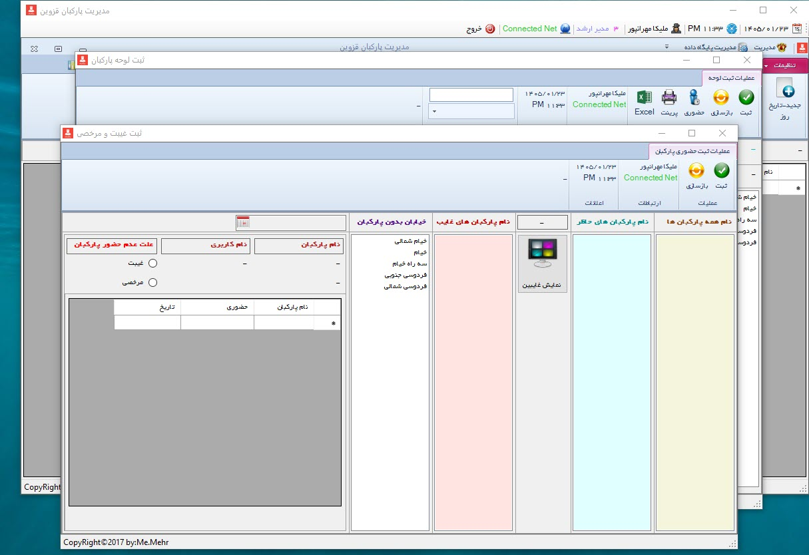
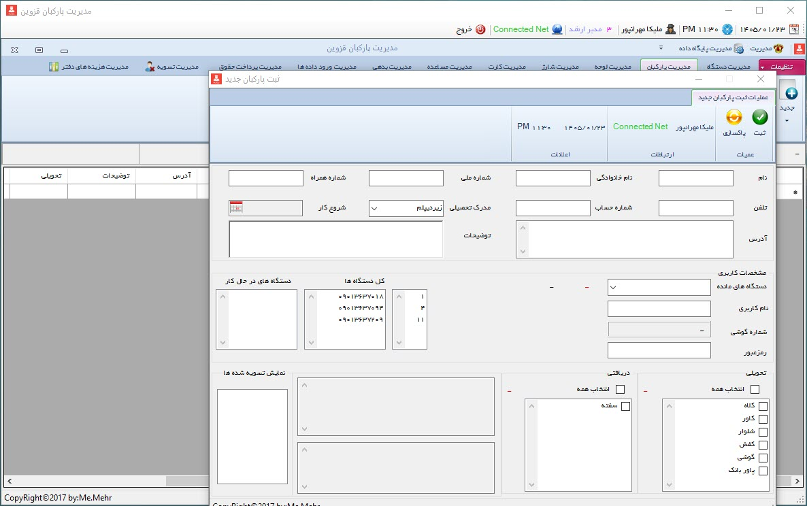
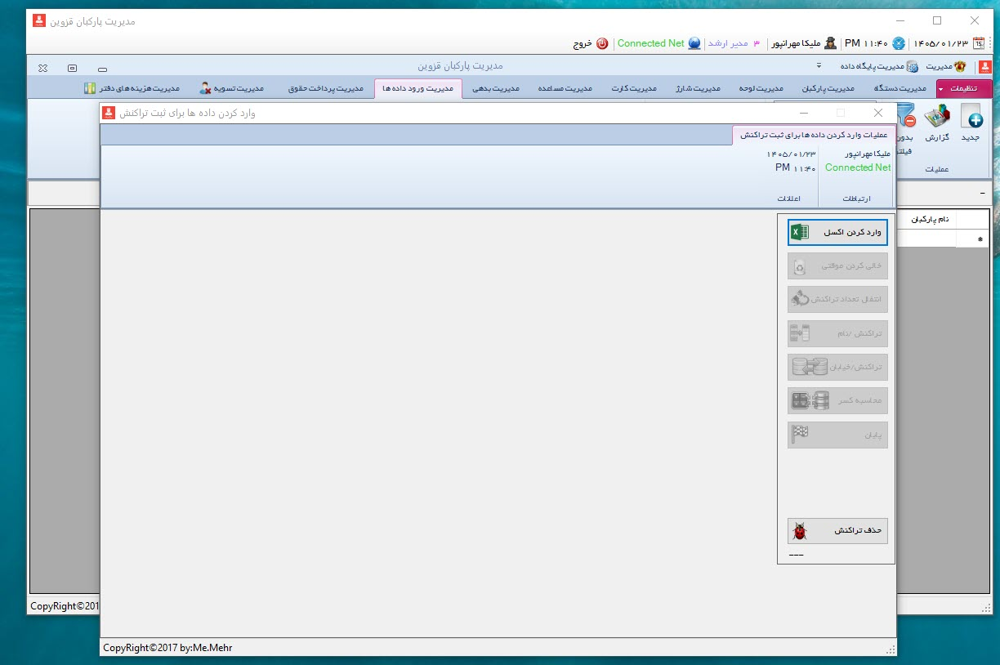
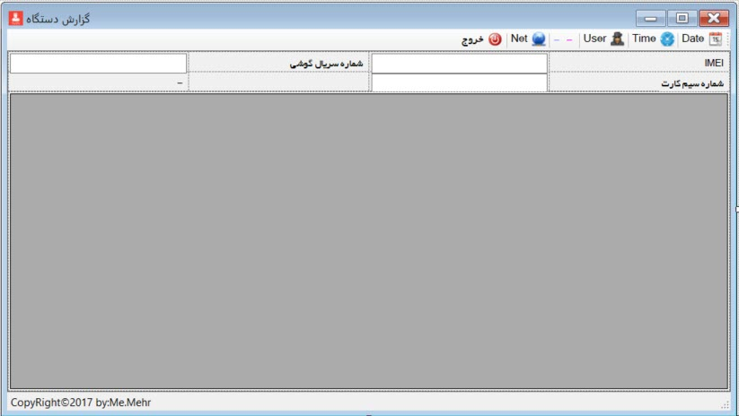

# parkban-parking-attendant-management-system
Windows Forms-based management system for municipal parking attendants, including personnel, attendance, device, payroll, recharge and financial management.

# Parkban – Parking Attendant Management System

**Parkban** is a Persian term meaning **parking attendant**.  
This project is a Windows Forms-based management system developed for a municipal parking operations environment to manage parking attendants, assigned devices, daily attendance, recharge packages, card sales, payroll, settlements, office expenses, and other financial operations.

Originally developed between 2016 and 2017 as an enterprise desktop application.
## Overview

Parkban was designed as an integrated desktop application to support the operational and administrative workflow of parking attendants working under a municipal contractor.

The system was used to register personnel information, manage assigned mobile devices and equipment, track attendance, import operational data from Excel files, calculate payroll, manage debts and advances, and generate various reports for management and accounting purposes.

Although the application did not directly read RFID cards or perform field operations itself, it processed operational data exported from external systems and used that data as part of payroll and financial calculations.

## Main Features

- User authentication with role-based access levels
- Personnel registration and management
- Device registration and assignment
- Street/zone assignment management
- Attendance and leave tracking
- Recharge package management
- Card sales and debt tracking
- Advance payment registration
- Debt management
- Excel-based data import workflow
- Payroll calculation and payslip printing
- Employee settlement workflow
- Office expense registration
- Reporting and printing across different modules
- Database connection, backup, and restore utilities
- Responsive WinForms layout with maximized views and ribbon-style UI

## System Modules

### 1. Login and Access Control
The system includes a login page with username, password, and access level selection.  
Three access levels were defined:

- Senior Manager
- Manager
- System User

A preview option was also available to open forms without logging in.

### 2. Main Dashboard
After login, the user enters the main ribbon-based interface.  
The system displays useful contextual information such as:

- Current date and time
- Logged-in username
- Access level
- Internet connection status

Because the database was hosted online and data could be entered from separate offices, connection visibility was important.

### 3. Device Management
This module manages the mobile phones assigned to parking attendants.

Functions include:
- Registering new devices
- Editing existing devices
- Searching and filtering devices
- Reporting

Each device record may include:
- IMEI
- Phone serial number
- Charger serial number
- SIM card number
- Notes

### 4. Parking Attendant Registration
This section is used to register new parking attendants and their administrative information, including:

- Full name
- National ID
- Phone number
- Account number
- Education
- Employment start date
- Address
- Notes

The module also supports:
- Device assignment
- Username/password creation
- Delivered items registration
- Received guarantee documents (such as promissory note / deposit record)
- Wizard-based step-by-step registration

### 5. Street Assignment Management
This module assigns parking attendants to specific streets or operational areas.

Depending on traffic level and street size, each street could be assigned one or more attendants.  
The module also supports:
- Search and filter
- Excel export
- Print
- Attendance access shortcut

### 6. Attendance Management
Attendance, absence, and leave were registered daily in this section.

Important capabilities:
- Register attendance for the current day
- Register attendance for the previous day
- Edit attendance records
- Print and export records
- Attendance validation by date entry

### 7. Recharge Management
Recharge packages delivered to attendants were tracked here.

The system recorded:
- Number of packages delivered
- Amount payable
- Payment status
- Date
- Related attendant

This module was designed to help monitor charge-related debts and transactions.

### 8. Card Management
This section managed citizen card inventory and sales.

Tracked information included:
- Delivered cards
- Sold cards
- Remaining cards
- Amount due
- Amount paid
- Previous debt
- Sales commission

This module also supported operational and financial visibility for each attendant.

### 9. Advance Payment Management
Advance payments given to attendants could be registered and edited here.

The form included:
- Attendant selection
- Total previous advances
- New advance amount
- Tracking/reference number
- Date

### 10. Debt Management
This module was used to register and edit debt records for attendants.

It displayed:
- Debt amount
- Date
- Historical debt total

### 11. Excel Data Import
Because the mobile application used by attendants only provided Excel outputs, this form was designed to import external operational data into the system.

Imported data included fields such as:
- Device IMEI
- User number
- Transactions
- Street name
- Amounts
- Related operational values

The workflow was step-based and used temporary tables before final transfer to the main database.

### 12. Payroll Management
This module calculated salaries based on administrative and imported operational data.

It included:
- Sales-based calculations
- Card sales commission
- Incentives
- Performance bonuses
- Absence deductions
- Debt deductions
- Equipment damage deductions
- Insurance deductions
- Advance payment deductions

At the end of the process, a printable payslip could be generated.

### 13. Settlement Management
When an attendant resigned, was terminated, or no longer worked with the contractor, the settlement form was used.

This module handled:
- Returned equipment
- Guarantee release
- Remaining debts
- Insurance-related values
- Transaction summaries
- Final settlement date

The record was soft-deactivated, meaning it remained in reports but was removed from active personnel lists.

### 14. Office Expense Management
This section tracked office expenses such as purchased goods and operational costs.

Registered fields included:
- Expense amount
- Item name
- Invoice or tracking code
- Payment source
- Payer name
- Expense date

### 15. Settings
The settings section allowed the system administrator to define and update:
- Account numbers
- Price values and rates
- Street records
- Delivered and received equipment/items

### 16. Database Management
The application also included database utility features such as:
- Resetting selected tables
- Configuring database connection
- Backup
- Restore

## Reporting

Reporting was available in many parts of the system.  
The application supported printed reports and, in some sections, chart-based reporting for sales, debts, and other operational metrics.

## User Interface Notes

The application was designed with a ribbon-style interface inspired by Microsoft Office.  
Many forms supported maximized display, and UI components were arranged to adapt to monitor scale and resolution as much as possible.

Common UI capabilities across forms included:
- Search and filtering
- Clear/reset buttons
- Current user display
- Date/time display
- Internet connection display
- Report actions
- Print support

## Screenshots

A full set of screenshots is available in the `screenshots` folder.

Example screenshot naming format:

- `1-1_Login_Form.jpg`
- `2-1_Device_Management.jpg`
- `3-1_Add_New_Parking_Attendant.jpg`
- `13-1_Import_Data_From_Excel.jpg`
- `14_Payroll_Registration.jpg`

## Key Screenshots

### Login & Attendance Management

  
  

  Login Form &nbsp;&nbsp;&nbsp;|&nbsp;&nbsp;&nbsp; Main Dashboard

---

### Personnel & Device Management

  
  

  Parking Attendant Management &nbsp;&nbsp;&nbsp;|&nbsp;&nbsp;&nbsp; Device Management

---

### Excel Import & Payroll

  
  

  Excel Import Process &nbsp;&nbsp;&nbsp;|&nbsp;&nbsp;&nbsp; Payroll Calculation

---

### Financial Settlement & Reports

  
  

  Financial Settlement &nbsp;&nbsp;&nbsp;|&nbsp;&nbsp;&nbsp; Management Report

---

Additional screenshots are available in the [`screenshots`](screenshots) folder.
## Source Code Samples

The repository also includes selected source code files from the original application to demonstrate the implementation of the main system modules.

- `NewAbsenceLeave.cs`  
  Attendance and leave registration form, including employee presence tracking, absence registration, and record editing.

- `Salary.cs`  
  Payroll and salary calculation form used for managing employee salaries, deductions, debts, advances, and monthly payments.

- `Management.cs`  
  System management module for defining access levels, creating system users, changing passwords, and configuring user permissions.

- `ManagementDB.cs`  
  Database management module including database connection settings, backup, restore, reset, and Excel import features.

- `ReportDevice.cs`  
  Device reporting module for displaying registered device information such as IMEI, phone number, SIM card number, charger serial, assigned user, and related notes. :contentReference[oaicite:0]{index=0}

The corresponding `.Designer.cs` files are also included to preserve the original Windows Forms interface design and layout.

## Documentation

Additional Persian documentation for the forms and system structure is available in the `docs` folder.

## Technologies Used

- C#
- Windows Forms
- SQL Server
- Excel-based data import
- Desktop reporting tools

## Notes

This repository is intended as a portfolio and documentation version of the project.  
Some business-specific details, operational values, and real-world data have been omitted or generalized for privacy and presentation purposes.

## Author

👩‍💻 Melika Mehranpour  
Senior Software Engineer | .NET & Enterprise Systems  

C# • .NET Framework • Windows Forms • SQL Server • Payroll Systems • Desktop Applications

🔗 [LinkedIn](https://www.linkedin.com/in/melika-mehranpour-41b627161/) | [GitHub](https://github.com/MelikaWorks)

## License
See the [LICENSE](LICENSE) file for license information.
